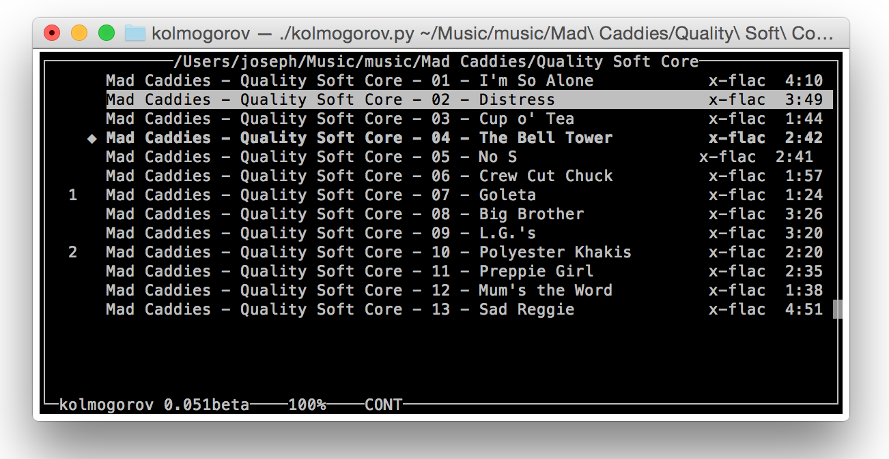

# kolmogorov
a (very) lightweight iTunes clone for *UNIX

*This is a program I wrote in 2007 for the heck of it*

Written by G. G. Venturini, (c) 2007

Released under GPL v3. See: http://www.gnu.org/copyleft/gpl.html

This program is a python/curses front-end to `mpg123`, `ogg123`,
`flac123` and `mplayer`. It may be extended to support more players.

Usage: 
	
	kolmogorov [options] [/path/to/music/files]

  or
	
	kolmogorov [options] [/path/to/playlist.m3u]

 The path to music files is a directory. It may be omitted, if so,
 kolmogorov will try to load `~/.kolmogorov_playlist.m3u` where the
 last playlist was saved on quit. If it doesn't exist, it will halt.

Available options are:

	-p (--players)	print a list of known audio formats and players.
	-h (--help)	print this help and quit.
	-L (--license)	 print info about this software's license terms.
	-r (--recursive)	load recursively all subdirs too.
	-s (--sort)	sort playlist (case insensitive).
	-t (--tag)	prints if there is tag support.
	-V (--version)	print version and quit.

Available commands in curses mode:

	up/down arrows (or j-k), page-up/page-down, home/end move the cursor.
	<space>/<enter>	play song under cursor.
	+	add selected song to playing queue.
	-	remove selected song from playing queue.
	S	show playing song.
	s	case-insensitive sort of playlist.
	c	enable or disable continuos play mode.
	T	switch between tag information and filename.
	r	refresh screen.
	q	quit.
